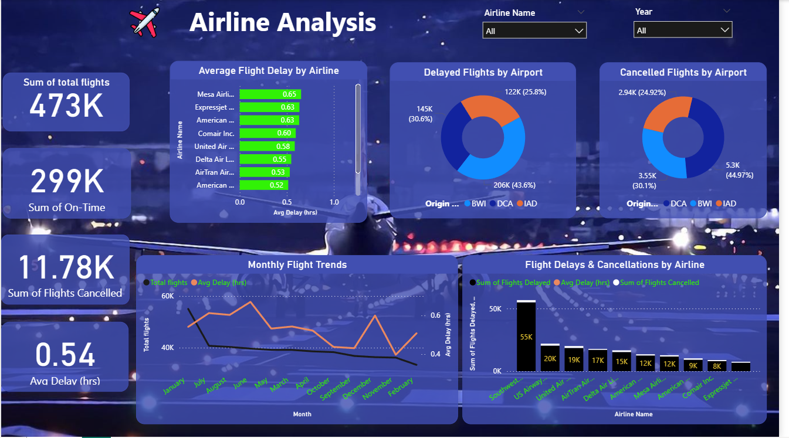

# ✈️ Airline Analysis Dashboard  

📌 **Overview**  
An interactive **Power BI dashboard** for analyzing airline performance: delays, cancellations, and on-time trends.  

🎯 **Highlights**  
- KPI cards: Total Flights, On-Time %, Cancellations  
- Pie/Donut charts: Delay reasons  
- Bar/Line charts: Flights by airline & trends  
- Interactive filters for deeper insights  

🛠 **Tech Stack**  
Power BI | Excel | DAX  

📂 **Repo Contains**  
- `Airline_Dashboard.pbix` → Dashboard file  
- `data/` → Dataset  
- `images/` → Screenshots  
- `README.Rmd` + `README.md`  

👨‍💻 **Author**: Sachin | Anna University RC Tirunelveli  

